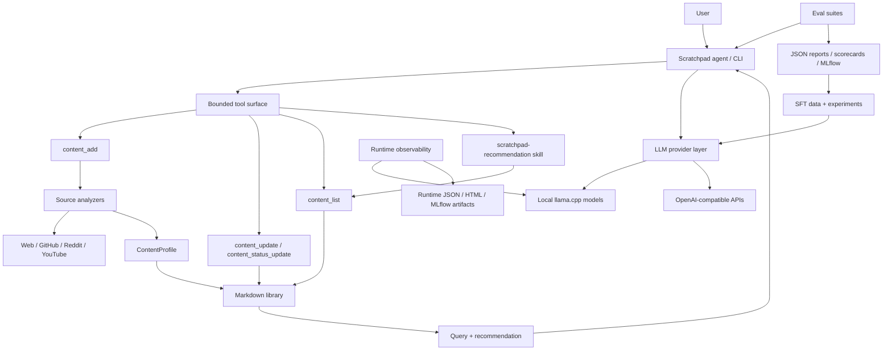

# Scratchpad

A local-first LLM agent testbed for tool routing, evaluation, and small-model reliability.

Scratchpad is a bounded agent system for testing whether local and small LLMs
can reliably perform useful personal workflows with explicit tools, evals,
traces, Markdown persistence, and SFT experiments.

It combines:

* a bounded tool surface for saving, updating, and querying learning content
* deterministic evals for tool choice, retention, recommendations, workflows, and content profiling
* local/API model profiles for comparing model behavior
* SFT data pipelines for improving small-model tool routing
* inspectable Markdown persistence, traces, and evaluation artifacts

---

## What it does

Scratchpad uses a personal learning inbox as the concrete product loop for
testing local/small LLM agents. It helps you manage what to learn when you have
limited time, while providing a realistic environment for measuring whether
models can handle useful personal-knowledge workflows.

You can save anything:

* articles
* papers
* videos
* threads
* notes

Then later ask:

* “I have 20 minutes, what should I read?”
* “Give me something light”
* “Show me deep dives on RL”

Each item is automatically classified (e.g. depth and estimated time), so the system can suggest what fits your current context.

---

## Core idea

Scratchpad is not primarily a link saver. It is a bounded agent testbed with a
real user-facing workflow.

It is a system that:

* estimates how much attention something requires
* helps you choose what to consume next
* resurfaces things at the right time
* creates repeatable tasks for evaluating local/small LLM behavior
* records inspectable artifacts such as Markdown state, tool calls, eval reports, traces, and training datasets

The product goal is to make reading and learning more intentional. The
engineering goal is to use that bounded product loop to test whether small/local
LLMs can reliably choose tools, ground arguments, persist state, retrieve
context, and make useful recommendations under realistic constraints.

The key loop is:

```text
capture source -> analyze into a content profile -> save as Markdown -> query/recommend later -> update status -> evaluate what the model did
```

This loop matters because it is small enough to run locally, but real enough to expose local-model failures that isolated prompts hide: wrong tool choice, weak extraction, bad time estimates, hallucinated summaries, poor ranking, missing persistence, and unhelpful recommendations.

## Architecture



### Product success hypotheses

Scratchpad should be judged by a few concrete hypotheses:

* Given a time budget and a rough goal, the assistant can recommend 1-3 saved items that are actually worth reading or watching now.
* Saved metadata should make future retrieval and recommendation better than searching raw links alone.
* User-visible explanations should cite concrete item metadata such as status, estimated time, depth, subject, categories, and match reason.
* Small/local models should be able to complete the core workflow reliably enough to be useful, even if larger models remain better judges.
* Every important workflow should leave inspectable artifacts: Markdown files, Git commits, eval fixtures, reports, or test output.

---

## Local LLM testbed

The learning-inbox product gives the models a realistic but bounded job:
ingest a source, produce a useful profile, store it, retrieve it, recommend it,
and update state later. That loop is used to compare local/API models, measure
tool-routing failures, track latency and runtime behavior, and test whether
narrow SFT can improve small-model tool use without catastrophic forgetting.

---

## Evaluation goal

Over time, Scratchpad should include a small eval set built from valuable, recent links that are less likely to be memorized by model training data.

The intended eval loop:

* collect fresh URLs across articles, repos, Reddit threads, videos, and papers
* freeze fetched source text/transcripts/metadata into fixtures
* run different local models against the same content-profile tasks
* judge outputs for usefulness, faithfulness, topic accuracy, depth, and time estimates
* optionally use a larger/better local model as an LLM judge for qualitative scoring

The unit tests should stay deterministic. Model-quality evals should live in explicit scripts so they can be run manually when comparing prompts or models.

The evaluation ladder is:

* deterministic unit tests for storage, parsing, query behavior, safety checks, and fake-model tool routing
* tool-choice evals for whether a real local model chooses the right first tool and required arguments
* content-profile evals for whether a model produces useful, faithful, normalized metadata from frozen source text
* deterministic workflow evals for whether save, query, recommendation constraints, and status updates compose correctly
* deterministic recommendation evals with fake libraries, fake user profiles, user requests, and expected ranking constraints
* retention evals for whether a fine-tuned small model still answers ordinary no-tool requests

The project should avoid treating a green eval as a vague "model is good" claim. Each eval should name the behavior it measures and preserve enough output to compare local models over time.

### Training experiments

Scratchpad includes a first learning-first SFT experiment for `Qwen3.5-0.8B`:

```text
experiments/tool_choice_sft_v1/
```

The experiment asks whether a sub-1B model can improve on Scratchpad tool routing
after narrow SFT while preserving normal assistant behavior. It compares base vs
SFT on tool-choice metrics, retention checks, failure-type deltas, and latency.

### Model profiles

Model selection is intentionally profile-based. Committed defaults live in
`config/models.json`; personal overrides such as local start scripts or
machine-specific endpoints should live in ignored `config/models.local.json`.

Profiles describe the model identity and connection details, while eval scripts
still allow one-off overrides:

```bash
uv run python scripts/models.py list
uv run python scripts/models.py show gemini-flash
uv run python scripts/eval_tool_choice.py --profile qwen-local
uv run python scripts/run_benchmark.py --profile gemini-flash --label gemini-smoke
```

Scratchpad does not require owning server lifecycle. By default, profiles are
`user_managed`: the user starts the local or remote server, and Scratchpad checks
the endpoint. A local override can add a `start_script`, and evals can opt into
auto-start behavior for known llama.cpp setups.

### Failure taxonomy

Local-model failures should be tracked in product terms, not just pass/fail:

* schema failure: invalid JSON, missing fields, invalid enum values
* source-identity failure: wrong URL, title, source type, or source ID
* faithfulness failure: summary or metadata claims unsupported by the source
* usefulness failure: subject/categories are too generic to help retrieval
* time/depth failure: estimates do not match how hard the item is to consume
* tool-choice failure: wrong tool, no tool, extra tool, or missing required arguments
* persistence failure: user asked to save/update, but the library state did not change correctly
* recommendation failure: ignores status, time budget, user goals, or cannot explain why an item fits

---

## Current state

Early development, with the core local-agent loop in place:

* flat Markdown persistence under `library/items/`
* deterministic deduplication by source identity or URL
* a normalized `ContentProfile` / `ContentItem` contract in code
* content add, list, update, and status-update tools
* a `scratchpad-recommendation` skill that requires querying saved items before recommending
* a local editable user profile at `library/user/profile.md` exposed through `user_profile_get`
* basic metadata and free-text query over Markdown frontmatter/body with explicit query-policy metadata
* separate Git history for personal library mutations
* deterministic pytest coverage for analyzers, tool policy, executor safety, library behavior, and eval scoring
* manual model eval scripts for content profiles and tool choice
* deterministic workflow evals for save -> list/recommend -> status-update product flows
* deterministic recommendation ranking evals with fake libraries and fake user profiles
* experiment observability through JSON reports, scorecards, optional MLflow logging, and runtime HTML artifacts

---

## Tech stack (initial)

* Python
* Markdown files as the likely first persistence layer
* SQLite later if querying and ranking outgrow file-based storage
* HTTP-based LLM calls (OpenAI-compatible)
* Local models via llama.cpp

---

## Library and data model

Analyzer tools return a normalized `ContentProfile` so articles, papers, repos,
videos, threads, and notes can be stored and ranked through one contract. The v1
profile includes source identity, URL, title, summary, subject, categories,
depth, estimated consumption time, optional learning effort, confidence, and
source metadata.

The Markdown library is intentionally not separated by source. Files live under:

```text
library/
  .git/
  items/
    <source-type>-<topic-slug>-<stable-hash>.md
```

Retrieval is by metadata and text: subject, category, depth, available time,
status, and free-text query. Querying is intentionally simple in v1:
`content_list` scans Markdown frontmatter/body in memory and returns match
scores, match reasons, and query-policy metadata. This keeps recommendation
behavior debuggable before adding SQLite or embeddings.

Core tools:

* `analyze_source`: inspect a source before saving it
* `content_add`: analyze and save a source, updating duplicates instead of creating new files
* `content_list`: query saved items, defaulting to `status=["unread", "started"]`
* `content_update`: correct saved item metadata or notes
* `content_status_update`: update reading state: `unread`, `started`, `done`, `archived`, `abandoned`

### Library history

The content library is versioned separately from the application code under
`library/.git`. This is not just backup; it makes local-model experiments easier
to inspect:

* every saved or updated item has an operation-level commit
* analyzer and recommendation behavior can be audited through diffs
* failed Git commits are reported in tool output without blocking the content write
* the app repo and the personal library history stay separate

History viewing, diffs, and restore commands are planned later. For now, Git is
used to make library mutations observable while keeping Markdown as the source
of truth.

---

## Running locally

1. Set environment variables in `.env` or your shell:

```bash
LLM_PROVIDER=llama_cpp
LLM_BASE_URL=http://localhost:8080/v1
LLM_MODEL=Qwen3.5-0.8B-BF16
LLM_API_KEY=
LLM_START_SCRIPT=/path/to/run-model-server.sh
```

2. Run the chat app:

```bash
uv run python main.py
```

3. The app will start the local server automatically for `llama_cpp` if needed.

### Tests and evals

```bash
uv run pytest
uv run python scripts/eval_tool_choice.py --profile qwen-local --report reports/tool-choice.json
uv run python scripts/eval_content_profiles.py
uv run python scripts/eval_retention.py
uv run python scripts/eval_workflows.py
uv run python scripts/eval_recommendations.py
uv run python scripts/run_benchmark.py --profile qwen-local --label qwen-smoke
```

Eval scripts write explicit reports with metrics, grouped failure types, latency,
and enough raw output to compare local/API models over time. Tool-choice evals
inspect the first model-selected tool call without executing tools, so save and
update intents can be tested safely.

### Chat commands

The REPL in [main.py](main.py) supports `/reset`, `/reload`, `/model`, and
`/server-status` for basic local-model iteration.

---

## Project structure (initial)

```text
app/
  content.py  # normalized content profile/item contract
  fetchers/   # source-specific fetching and extraction
  library/    # Markdown-backed content storage
  llm/        # model client, runtime, and prompting
  tools/      # tool implementations and registry

skills/       # markdown skill definitions
library/      # local Markdown content items and their separate Git history, created as needed

scripts/      # dev scripts
evals/        # frozen model-eval fixtures
tests/        # deterministic pytest unit tests
```

---

## Philosophy

* focus on usefulness first
* start simple, refine over time
* use rough estimates, then learn from behavior
* keep systems observable and debuggable
* avoid premature abstraction
* prefer transparent scoring before semantic search or embeddings
* keep local-model constraints visible in tool and prompt design

---

## Roadmap

Near-term work:

* run the real heldout baseline for Qwen 0.8B
* export train/validation/heldout SFT datasets and inspect rendered templates
* run the first small LoRA/QLoRA tool-routing SFT
* compare base vs SFT by difficulty, context kind, failure type, retention, and latency
* make llama.cpp observability live by enabling `/metrics`, writing a PID file, and polling runtime status
* keep recommendation behavior explainable before adding heavier ranking or semantic search
